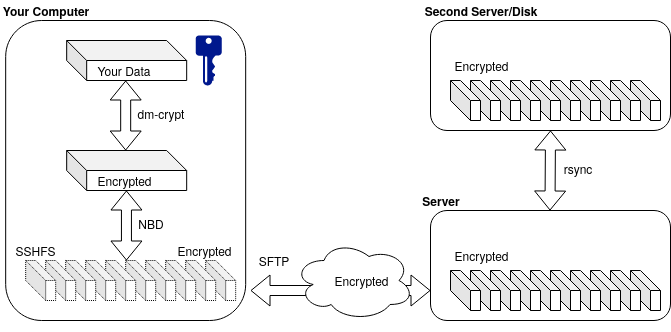

# Poor Man's Encrypted Backup Solution

### What is it?
These are a couple of shell scripts, which will guide you through the creation of encrypted backup, suitable for the following usage scenario:

- Fully and securely encrypted backup using only known, established, open-source technology (see below);
- The backup is spltted over multiple files, with the goal of easily running `rsync` over them - for example in a `cron` job copying to another disk in the night times;
- No overhead to the computer, where the backup is stored - i.e. usable with weaker pc's or [Raspberry Pi](https://www.raspberrypi.org/);
- No special requirements on the server side besides a standard `sftp`;
- Read-Write mountable as a local directory;
- The backup server has zero-knowledge about the contents and never sees the key, or the unencrypted data- i.e. suitable for cloud backups;

### Important notes:

- The used software - i.e. `cryptsetup`, `sshfs` and `nbd` - are all mature and stable projects. However my scripts are not. So please take a look at the code first and **USE AT YOUR OWN RISK**;
- There is a caveat when using `nbd-server` with lots of files. Adjust `/etc/security/limits.conf` (system wide) or use my [patched version of nbd](https://github.com/vlzware/nbd);
- The `pmebs-create` script defaults to outputting the LUKS header in the user's home directory. Please consider, that **if you lose or damage this file your data is irrevocably lost**;
- Consider that if you are setting up a large backup volume, the whole size will be created and filled with random data, which may put a lot of stress on the disk. See `pmebs-create.sh` for controlling this behaviour (look at `DOWIPE`).

### Usage
How to use in a typical scenario:

- Open `pmebs.conf` and adjust the settings to your liking (or at least fill in your non-root user name);
- Call `sudo /path/to/pmebs.sh` with the `-create` option from the directory, where you wish to have the encrypted data;
- If all goes well, when the script is done, the backup will be ready and mounted read-write (by default under `/home/<user>/PMEBS.<backup_name>/mnt.<backup_name>`);
- This behavior is to speed up the first filling with data, which could otherwise take more time if done over the network;
- Fill your data in the mounted volume;
- Call `sudo /path/to/pmebs.sh` with the `-lumount` option do disconnect and close everything;
- Move the encrypted data `<name>.DATA` to where you like it on the remote SFTP Server;
- Call the script for remote mounting. For example: `sudo /path/to/pmebs.sh -mount <my_backup_name> <ftp_user>@XX.XX.XX.XX:/path/to/backup`
- If successful the script will mount your remote backup as if it where local;
- Unmount when done with the `-umount` option;
- Take good care of the configuration directory in your `$HOME` - it contains the header, the `nbd.conf` file and the mounting points.

### Used Software:
The script uses the following great open-source software:

- [LUKS/dm-crypt](https://gitlab.com/cryptsetup/cryptsetup/-/wikis/FrequentlyAskedQuestions) for the actual encryption:
- [sshfs](https://github.com/libfuse/sshfs) for mounting the backup over the network:
- [nbd](https://github.com/NetworkBlockDevice/nbd) for representing the multitude of files as single virtual file

The diagram above made with [draw.io](https://draw.io)